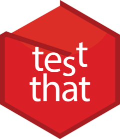

<!-- README.md is generated from README.Rmd. Please edit that file -->
testthat 
=========================================================

[](https://travis-ci.org/r-lib/testthat) [](https://ci.appveyor.com/project/r-lib/testthat) [](https://codecov.io/github/r-lib/testthat?branch=master) [](https://cran.r-project.org/package=testthat)

Overview
--------

Testing your code can be painful and tedious, but it greatly increases the quality of your code. **testthat** tries to make testing as fun as possible, so that you get a visceral satisfaction from writing tests. Testing should be addictive, so you do it all the time. To make that happen, testthat:

-   Provides functions that make it easy to describe what you expect a function to do, including catching errors, warnings, and messages.

-   Easily integrates in your existing workflow, whether it's informal testing on the command line, building test suites, or using R CMD check.

-   Displays test progress visually, showing a pass, fail, or error for every expectation. If you're using the terminal or a recent version of RStudio, it'll even colour the output.

testthat draws inspiration from the xUnit family of testing packages, as well as from many of the innovative ruby testing libraries, like [rspec](http://rspec.info/), [testy](https://github.com/ahoward/testy), [bacon](https://github.com/chneukirchen/bacon) and [cucumber](https://cucumber.io).

testthat is the most popular unit testing package for R and is used by thousands of CRAN packages.

If you're not familiar with testthat, the [testing chapter](http://r-pkgs.had.co.nz/tests.html) in [R packages](http://r-pkgs.had.co.nz/) gives a good overview, along with workflow advice and concrete examples.

Installation
------------

``` r
# Install the released version from CRAN
install.packages("testthat")

# Or the development version from GitHub:
# install.packages("devtools")
devtools::install_github("r-lib/testthat")
```

Usage
-----

The easiest way to get started is with [usethis](https://github.com/r-lib/usethis). Assuming you're in a package directory, just run `usethis::use_test("name")` to create a test file, and set up all the other infrastructure you need. If you're using RStudio, press Cmd/Ctrl + Shift + T to run all the tests in a package.
